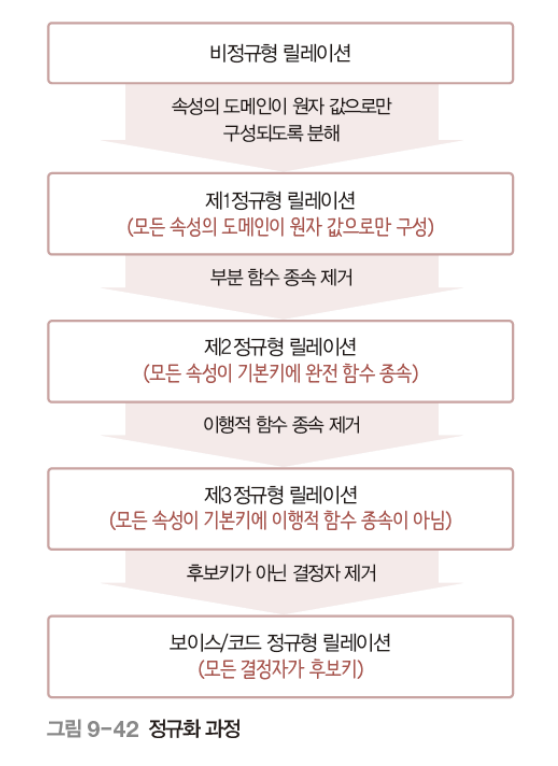

## 정규화

### 정의
함수 종속성을 이용해  
릴레이션을 연관성 있는 속성으로만 구성되도록 분해해  
이상 현상이 발생하지 않는 올바른 릴레이션으로 만들어가는 과정

### 함수적 종속성
릴레이션 내 모든 튜플에서 하나의 X 값에 대해 Y 값이 항상 하나임 
하나의 릴레이션을 구성하는 속성들의 부분집합인 X와 Y
## 정규형

### 정의
릴레이션이 정규화된 정도 
릴레이션의 특성 고려해 적합한 정규형 선택 

### 제 1 정규형
릴레이션에 속한 모든 속성의 도메인이 원자 값으로만 구성됨

### 제 2 정규형
릴레이션이 제 1 정규형에 속하고  
기본키가 아닌 모든 속성이 기본키에 완전 함수 종속됨
### 제 3 정규형
릴레이션이 제 2 정규형에 속하고 
기본키가 아닌 모든 속성이 기본키에 이행적 함수 종속이 되지 않음

`이행적 함수 종속`
릴레이션 구성하는 3개의 속성 X, Y, X에 대해 함수 종속 관계 X->Y와 Y->Z가 존재해 X->Z가 성립함
### 보이스코드 정규
릴레이션의 함수 종속 관계에세 모든 결정자가 후보키이면 보이스코드 정규형에 속함

### 정규형 과정
