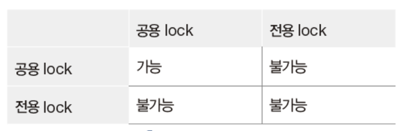

## 트랜잭션

### 정의
하나의 작업 수행에 필요한 데이터베이스 연산을 모은 것 
논리적인 작업 단위 
병행 제어와 회복 작업의 기본 단위임

## 병행 제어
### 병행 수행
여러 사용자가 데이터베이스를 동시 공유할 수 있도록 해 여러개의 트랜젝션을 동시에 수행하는 것

### 정의
병행 수행 시 같은 데이터에 접근해 연산 실행해도 문제가 발생하지 않고 정확한 수행 결과를 얻을 수 있도록 트랜잭션 수행을 제어하는 것

### Locking 기법

1. 기본 원리

    한 트랜잭션이 먼저 접근한 데이터에 대한 연산을 끝낼 때까지 다른 트랜잭션이 그 데이터에 접근하지 못하도록 하는 상호 배제(mutual exclusion)

2. lock과 unlock 연산을 활용한 제어

    `lock` : 트랜잭션이 데이터에 대한 독점권을 요청하는 연산

    `unlock` : 트랜잭션이 데이터에 대한 독점권을 반환하는 연산

3. 기본 locking 규약

* 트랜잭션이 데이터 접근을 위해 lock 연산 실행을 통한 독점권 획득
* 다른 트랜잭션에 의해 lock 연산 실행된 데이터에 다시 lock 연산 실행 불가능
* 독점권 획득한 데이터에 대해 모든 연산 수행 끝나면 트랜잭션은 다시 unlock 연산 실행을 통한 독점권 반환

4. 로킹 단위 - 병행성 - 제어
* 로킹 단위 커짐 - 병행성 작음 - 제어 쉬움
* 로킹 단위 작음 - 병행성 큼 - 제어 어려움

5. 기본 locking 규약 효율성 높이기

    트랜잭션이 데이터에 대해 `공용 lock` 연산 실행
    * read 연산 실행 가능
    * write 연산 실행 가능
    * 다른 트랜잭션도 공용 lock 연산 동시에 실행 가능
 
 

    트랜잭션이 데이터에 대해 `전용 lock` 연산 실행
    * read 연산 실행 가능
    * write 연산 실행 가능
    * 다른 트랜잭션도 어떠한 lock 연산 (전용/공용) 모두 실행 불가능

     
        Lock 연산의 양립성

    

## 교착상태

### 정의
트랜잭션들이 상대가 독점하고 있는 데이터에 unlock 연산이 실행되기를 서로 기다리면서 트랜잭션 수행을 중단하고 있는 상태

## 트랜잭션 격리 수준