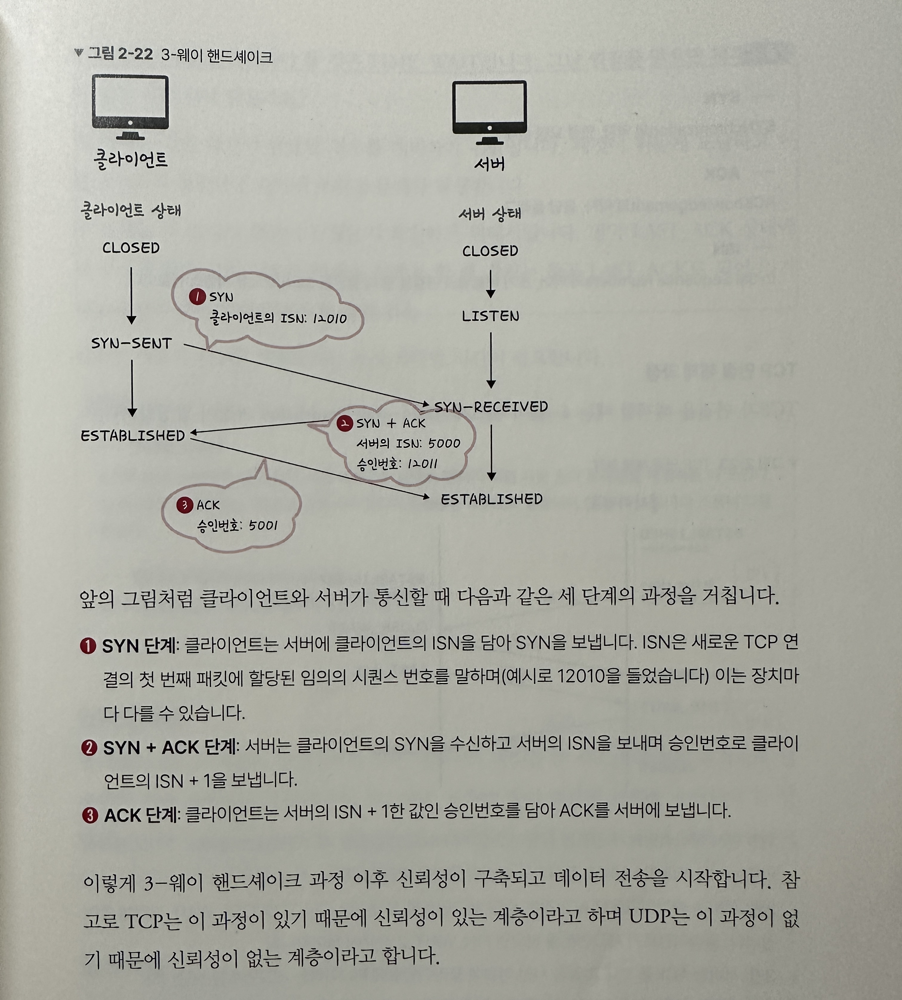
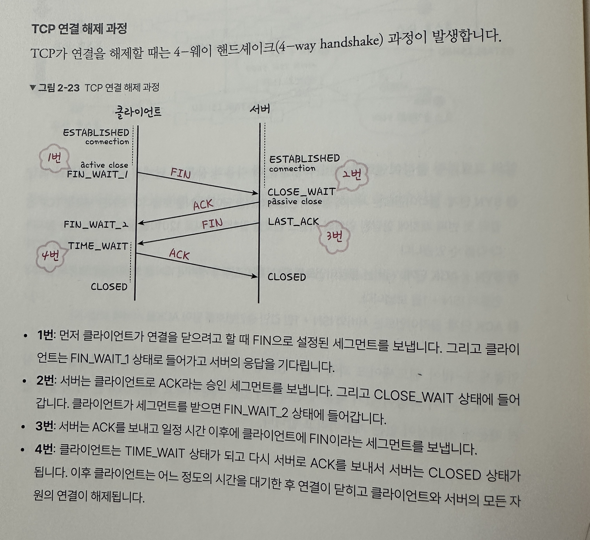
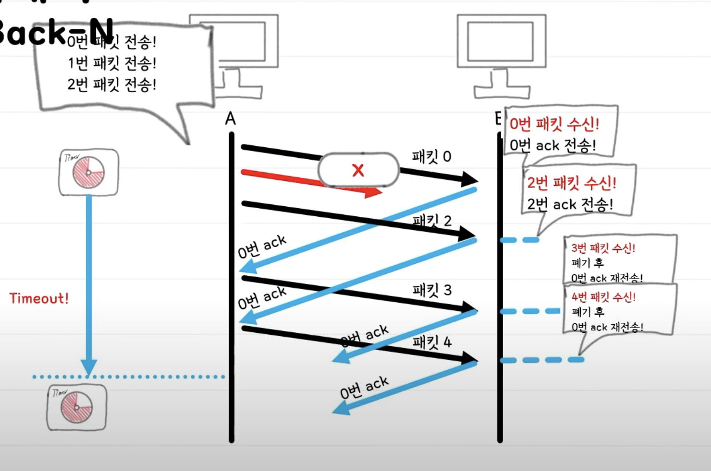
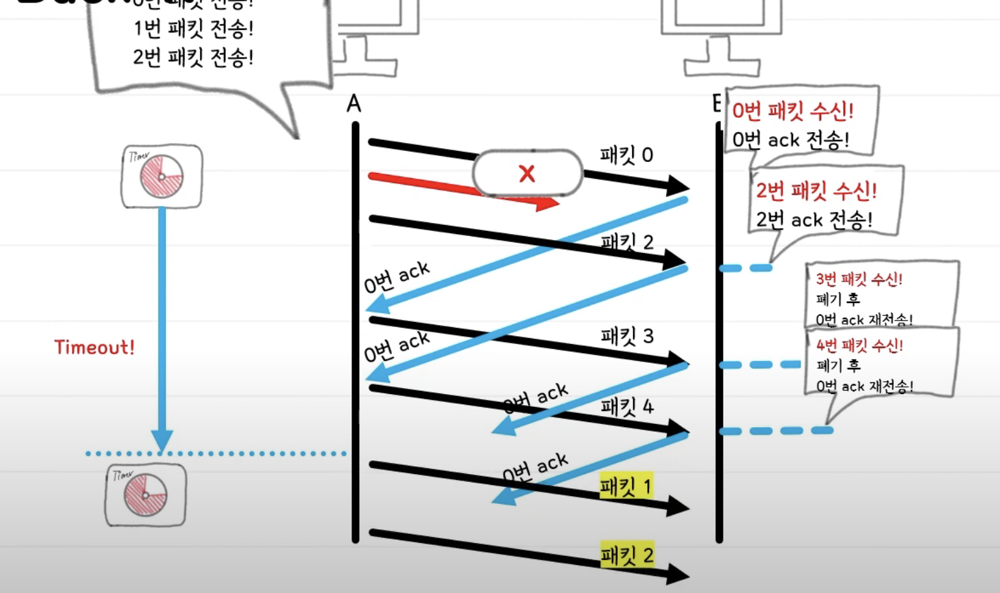

## Transport 계층
### 정의
Transmission Control Protocol (사용자 전송 제어 프로토콜)

**End Point 간 `신뢰성` 있는 데이터 `전송`을 담당하는 계층**

* 신뢰성 : 데이터를 순차적, 안정적인 전달
* 전송 : 포트 번호에 해당하는 프로세스에 데이터 전달

( port 번호 사용하여 도착지 컴퓨터의 최종 도착지인 프로세스까지 데이터가 도착하게 하는 모듈 )

### TCP와 UDP
* OSI 참조 모델 4계층에서 동작하는 프로토콜
* 3계층에서 동작하는 IP와 5~7계층에서 동작하는 어플리케이션(HTTP 등) 중계
### 교환 방식
1.  회선 교환 방식
2. 가상회선 패킷 교환 방식
* 각 패킷에는 가상회선 식별자가 포함되며 모든 패킷을 전송하면 가상회선이 해제되고 패킷들은 전송된 **순서대로** 도착하는 방식
3. 데이터그램 패킷 교환 방식
* 패킷이 독립적으로 이동하며 최적의 경로를 선택함
* 하나의 메세지에서 분할된 여러 패킷을 서로 다른 경로로 전송될 수 있으며 도착한 **순서가 다를 수** 있는 방식

### PORT

1. 정의

    통신하는 대상 컴퓨터의 어플리케이션을 특정하는 번호

2. **IP 주소만으로 통신 불가능한가? 왜 PORT 번호가 필요한가?**

    A: 한 개의 서버에서 웹서버와 메일서버가 동시에 실행 중 일 때, IP 주소만으로는 웹서버로 가는 통신인지 메일서버로 가는 통신인지 알 수 없음
3. 포트 번호 종류

    |타입|범위|설명|
    |:--:|:--:|:--:|
    |well known port|0~1023|서버 측 어플리케이션에서 사용|
    |registered port|1024~49151|well known port에 없는 독자적으로 만들어진 어플리케이션에서 사용|
    |dynamic port|49152~65535|클라이언트 측 어플리케이션에서 사용|

4. well known port

    |포트 번호|protocol|transport protocol|설명|
    |:--:|:--:|:--:|:--:|
    |80|HTTP|TCP|웹 서버 접속|
    |443|HTTPS|TCP|웬 서버 접속 (SSL/TLS 암호화)|
    |110|POP3|TCP|메일 박스 읽기|
    |25|SMTP|TCP|메일 서버 간 이메일 전송|
    |22|SSH|TCP|컴퓨터에 원격 로그인|
    |53|DNS|UDP|DNS 서버에 질의|
    |123|NTP|TCP|시간 동기화|

### Port Forwarding
* 패킷이 네트워크 게이트웨이(라우터, 방화벽 등)을 가로지르는 동안 특정 IP 주소와 포트 번호의 통신 요청을 다른 특정 IP와 포트 번호로 넘겨주는 서비스
* 게이트웨이 (외부말)의 반대쪽에 위치한 사설 네트워크에 상주하는 호스트에 대한 서비스를 생성하기 위함
* NAT 응용 기술

**포트 포워딩 X : 외부망의 호스트가 컴퓨터 1에게 요청 보낸 경우**

* 공인 IP로 들어오는 80번 포트의 연결을 컴퓨터 1의 80번 포트로 연결하라고 공유기에 설정함

**포트 포워딩 O : 외부망의 호스트가 컴퓨터 1에게 요청 보낸 경우**

* 내부에서 연결하려는 포트는 반드시 IP를 지정해야함
* 하나의 포트는 하나의 포워딩만 가능함
* 외부 포트와 내부 포트는 서로 다를 수 있음
    (80을 8080으로 전달 가능)
* 공유기가 할당한 IP에만 포워딩 가능

## TCP

### 정의

### 특징

1. 신뢰성 있음(Reliable): 패킷 손실, 중복, 순서 바뀜이 없음을 보장한다.
2. 연결지향적(Connection-oriented): 통신이 시작되기 전 송수신측 간 논리적 연결이 설정됨.
3. 양방향성(Full-Duplex): 항상 양방향 통신이 가능함. 클라이언트 → 서버 서버 → 클라이언트
4. 단대단(1:1) 전송 방식: 멀티 캐스트(1:多)가 불가능함.
5. 세그먼트화 처리: 바이트를 모아 세그먼트화 하고, 헤더를 붙여 순서를 제어한다.
6. 흐름 제어: 수신자의 처리 속도 맞춰 전송 속도 제어
7. 혼잡 제어: 네트워크 내 패킷 수가 과도하게 증가하는 현상 제어

### 세그먼트

1. 역할
4계층 프로토콜의 데이터 단위

2. 헤더 구성

    

3. 플래그
* SYN : 연결 요청 플래그 
* ACK : 응답 플래그
* FIN : 

4. 시퀀스 번호
* 순서 구분을 위한 바이트 단위 번호

5. ACK 번호
* 수신을 기대하는 바이트 번호

### 동작 과정

#### 1. **소켓 생성**

* 브라우저에서 도메인과 사용할 타입(TCP)를 설정해 소켓 호출함
* 프로토콜 스택이 이를 받아서 소켓 작성해 브라우저에게 디스크립터 반환함

#### 2. **3-way handshake** - connection 연결

* 브라우저에서 반환받은 디스크립터, 서버 IP 주소, 포트 번호와 함께 요청
* 프로토콜 스택이 이 요청을 받아서 웹서버로 요청 전달함

**연결 요청**

**응답 + 연결 요청**

**응답**

**정리**

#### 3. **데이터 송신과 수신**

**데이터 송신**

* 클라이언트에서 write 호출
* 브라우저에서 받은 HTTP request 메세지를 받아 패킷으로 만들어 서버에 전달

**데이터 수신**

* 클라이언트에 대한 응답을 위해 데이터를 만들고 패킷으로 클라이너트에게 전달
* 클라이언트는 read 호출하여 데이터 읽음

**중간에 패킷이 소실된 경우**

* 클라이언트는 서버로부터 일정 시간 동안 응답이 오지 않으면 이전 패킷을 다시 재전송해 요청함
* 재요청에 대해 또 응답이 오지 않으면, 클라이언트는 데이터 송신 작업 강제 종료하고 어플리케이션 오류 반환함

#### 4. **4-way handshake** - connection close

**연결 종료**

* 클라이언트에서 연결 끊기를 위한 close 호출과 플래그 FIN 설정해 서버에게 전달

**응답**

* FIN에 대한 응답으로 플래그를 ACK로 설정해 응답
* 클라이언트는 서버로 보냈던 FIN에 대한 응답 기다리는 상태

**연결 종료**

* 서버에서 close 호출하고 플래그는 FIN 설정해 클라이언트에게 전달

**응답**

* 클라이언트는 이를 잘 받았다는 의미로 플래그 ACK 설정해 서버에게 전달

**소켓 말소**
* 일정 시간 뒤에 클라이언트 소켓 말소되며 연결 종료됨

**⭐ TCP 연결 설정 과정과 연결 종료 과정이 차이나는 이유?**
* Client가 데이터 전송을 마쳤다 하더라도 Server는 아직 전송할 데이터가 남아있을 수 있음
* FIN에 대한 ACK을 전송한 뒤, 데이터 전송을 마친 후 FIN을 전송함으로 한단계를 더 거침

**⭐ 만약 Server에서 FIN 플래그를 전송하기 전에 전송한 패킷이 FIN보다 늦게 도착하는 상황이 발생하면?**
* 이러한 상황에 대비해 Client는 Server로부터 FIN 플래그를 수신하더라도 일정 시간 동안 세션을 남겨놓고 잉여 패킷을 기다리는 **TIME_WAIT** 거침

**⭐ 초기 Sequence Number인 ISN을 난수로 성정하는 이유?**
* ISN: 초기 네트워크 연결을 할 때 할당된 32비트의 고유 시퀀스 번호
* 이전 Connection의 순차적인 패킷으롱 오해받는 상황 방지

**정리**

### 흐름 제어 (End to End)

1. 필요성 / 문제 발생 원인
전송자와 수신자의 속도 차이로 인한 오류 발생하기 때문

2. 정의
수신자의 처리 속도에 맞춰 전송자의 통신 속도를 제어함

3. **Stop and Wait** 

    **과정 요약**
    
    
* 매번 전송한 패킷에 대해 확인 응답(ACK)을 받은 뒤에 다음 패킷을 전송
* 단순한 구현, 높은 신뢰성, 송수신 측 1개의 버퍼로 최대 프레임 크기 지정 가능
* 낮은 효율, 느린 속도, 비효율적임

4. **Sliding Window (Go Back N ARQ)**

    **window 크기**

    * 주로 수신자가 한번에 처리 가능한 데이터 크기
    * TCP 헤더 구성요소로 3 way handshake를 통해 수신 측의 recieve window size에 자신의 send window size 맞추게 함

    
    1. 윈도우 크기만큼 데이터를 순서대로 전달 
    (윈도우=7, 데이터 크기=1인 경우, 0번 데이터부터 최대 6번 데이터까지 차례로 전달됨)
    2. 수신자는 받은 데이터를 처리하고 ACK 패킷 보냄 + 메세지 헤더 안에 마지막으로 받은 데이터 번호 전달 
    (2번 데이터까지 받은 경우 ACK 패킷 헤더 안에 번호 2 들어있음)
    3. 전송자는 패킷 메세지를 통해 몇번 데이터까지 전송되었는지 확인하고 그 다음 순서부터 윈도우 크기 만큼 데이터를 다시 전송함 
    (2번을 받았기 때문에 슬라이드 윈도우를 2번부터로 옮겨 최대 7개 전송 가능)
 
 

    **에러 발생한 경우**
    
    

    1. 1번 패킷이 도착하지 못해 0번 ACK를 전송한 상태에서 멈춤  
    (1번 패킷 도착할 때까지 0번 ACK만 계속 보냄. 전송 측에서 계속 전송하는 패킷은 폐기함)
    2. 타임 아웃되어 패킷을 재전송할 때 다시 순서대로 패킷 1번, 패킷 2번, 패킷 3번... 보냄
    
    **전체 과정 요약**
    

### 혼잡 제어 

1. 필요성 / 문제 발생 원인
송신 측의 데이터 전달과 네트워크의 데이터 처리 속도 차이 발생

2. 혼잡
네트워크 내 패킷 수 과도하게 증가하는 현상

3. 원리  
천천히 데이터를 보내다가, 수신자의 원활한 수신이 확인되면, 속도를 높임 
수신자가 한참 전에 전달한 데이터까지만 받았다고 하면 네트워크 혼잡을 인지하고 속도를 줄임
    * 얼마나 속도를 높이는가
    * 혼잡을 감지하고 얼마나 속도를 줄이는가

4. **AIMD**
* Additive Increase / Multicative Decrease
* 가산 증가 방식
* 패킷 하나씩 늘려가며 Window size 조절
* 패킷 전송 실패하거나 일정시간이 지나면 window 사이즈 절반으로 감소
5. **Slow Start** 
* 지수 증가 방식
* 패킷을 2배수로 증가시켜 window size 조절

## UDP

### 정의
User Datagram Protocol (사용자 데이터그램 프로토콜)

### 특징 
1. 비연결성 : handshake 없음
2. 신뢰성 없음: 흐름제어, 순서제어, 확인 응답 없음
3. 순서화되지 않음: 순서번호 필드가 존재하지 않음
4. 실시간 응용 및 멀티캐스트 가능
5. 단순한 헤더: 고정 8 바이트

### UDP 헤더

* 8 바이트 고정된 길이의 해더
* 패킷 사이의 의존성 없음 -> 안정성 확보 위한 정보(데이터 번호, 플래그) 존재 X

### UCP 데이터 전송

1. **소켓 생성**

    * 브라우저에서 도메인과 사용할 타입(UDP)를 설정해 소켓 호출함
    * 프로토콜 스택이 이를 받아서 소켓 작성해 브라우저에게 디스크립터 반환함

2. **요청 및 데이터 송수신**

    * 클라이언트가 sendto 호출하고, 브라우저로부터 받은 Http request 메세지를 받아 패킷으로 만들어 서버에 전송함

3. **응답 및 데이터 송수신**

    * 서버에서 응답을 위해 sendto 호출
    * 패킷 소실되더라도 다음 데이터 바로 전송함 
    * 클라이언트는 데이터 손실 여부와 무관하게 recvfrom 호출해 데이터 수신함

---
1. PORT란? 주요 PORT?
2. TCP와 UDP란? 공통점과 차이점
3. 3-way handshake
4. 4-way handshake
5. NAT
6. PORT

---
1. 3 way handshake

2. 데이터 교환 과정

3. 4 way handshake 

4. TCP vs UDP 

## 참고
https://wormwlrm.github.io/2021/09/23/Overview-of-TCP-and-UDP.html

https://www.youtube.com/watch?v=ad4AO1shXsY

https://youtu.be/3ert33rqoB8

https://roka88.dev/114

https://m.blog.naver.com/gaegurijump/110188012832

[포트 포워딩](https://sangbeomkim.tistory.com/105)