## Transport 계층
1. 정의

    **End Point 간 `신뢰성` 있는 데이터 `전송`을 담당하는 계층**

    ```
    * 신뢰성 : 데이터를 순차적, 안정적인 전달
    * 전송 : 포트 번호에 해당하는 프로세스에 데이터 전달

    port 번호 사용하여
    도착지 컴퓨터의 최종 도착지인 프로세스까지 
    데이터가 도착하게 하는 모듈
    ```


## TCP

### 정의

### 회선 교환 방식 vs 패킷 교환 방식

### 헤더

1. 역할

2. 구성

    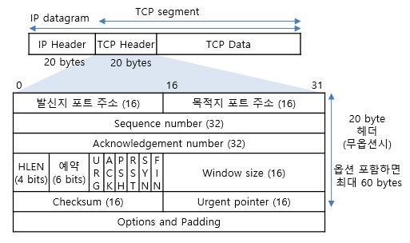


3. 플래그
* SYN : 
* ACK :
* FIN :

4. 시퀀스 번호

5. ACK 번호

### 동작 과정

1. **소켓 생성**
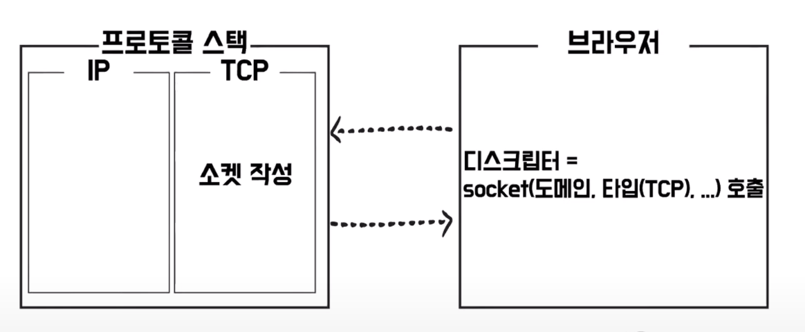
* 브라우저에서 도메인과 사용할 타입(TCP)를 설정해 소켓 호출함
* 프로토콜 스택이 이를 받아서 소켓 작성해 드스크립터 반환함


2. **3-way handshake** - connection 연결
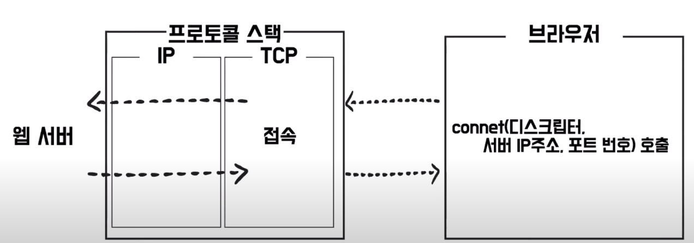
* 브라우저에서 반환받은 디스크립터, 서버 IP 주소, 포트 번호와 함께 요청
* 프로토콜 스택이 이 요청을 받아서 웹서버로 요청 전달함

    **전체 요약**
    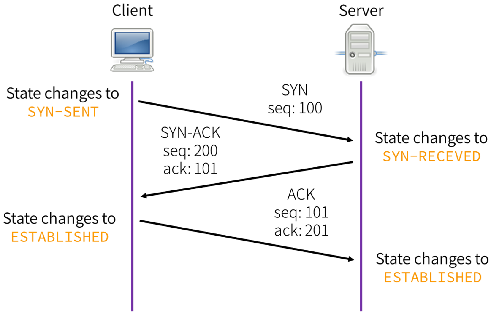

    **연결 요청**
    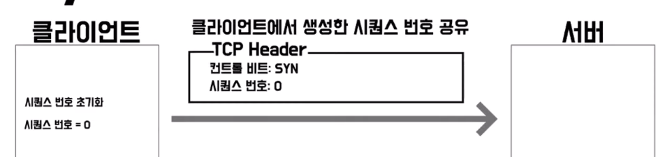

    **응답 + 연결 요청**
    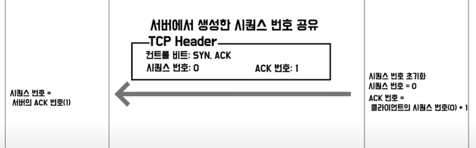

    **응답**
    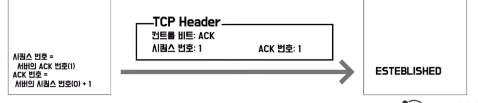

3. **데이터 송신과 수신**

    **데이터 송신**
    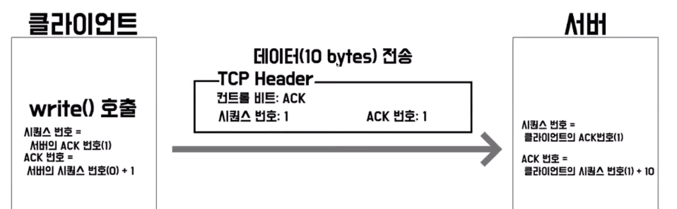
    * 클라이언트에서 write 호출
    * 브라우저에서 받은 HTTP request 메세지를 받아 패킷으로 만들어 서버에 전달

    **데이터 수신**
    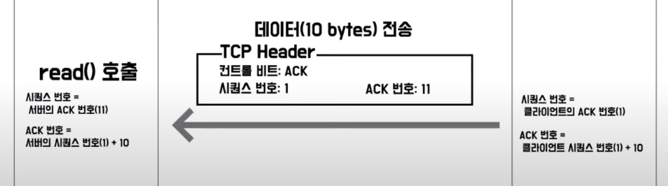
    * 클라이언트에 대한 응답을 위해 데이터를 만들고 패킷으로 클라이너트에게 전달
    * 클라이언트는 read 호출하여 데이터 읽음

    **중간에 패킷이 소실된 경우**
    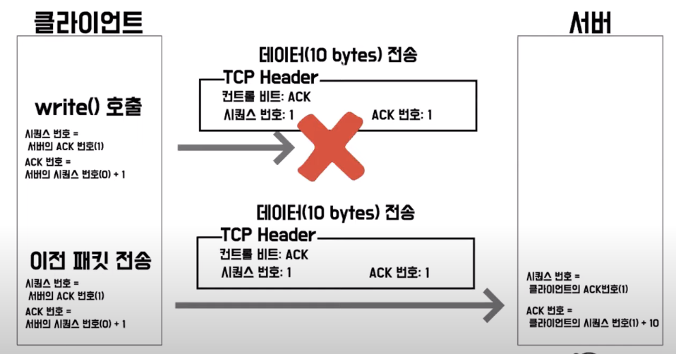
    * 클라이언트는 서버로부터 일정 시간 동안 응답이 오지 않으면 이전 패킷을 다시 재전송해 요청함
    * 재요청에 대해 또 응답이 오지 않으면, 클라이언트는 데이터 송신 작업 강제 종료하고 어플리케이션 오류 반환함

4. **4-way handshake** - connection close

    **연결 종료**
    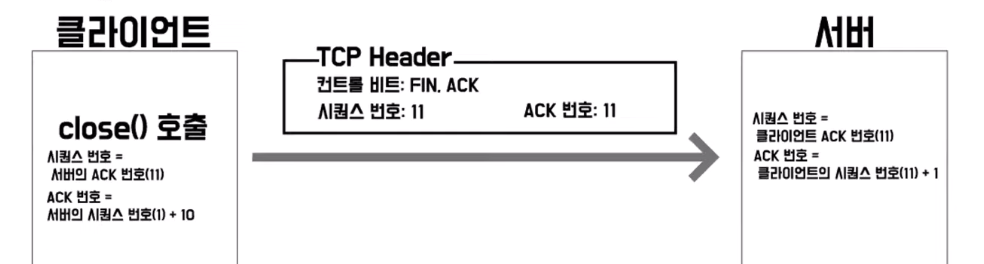
    * 클라이언트에서 연결 끊기를 위한 close 호출과 플래그 FIN 설정해 서버에게 전달

    **응답**
    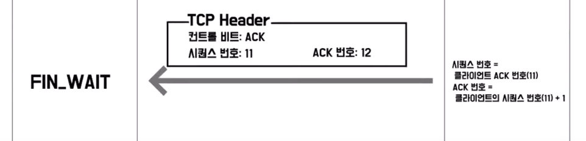
    * FIN에 대한 응답으로 플래그를 ACK로 설정해 응답
    * 클라이언트는 서버로 보냈던 FIN에 대한 응답 기다리는 상태

    **연결 종료**
    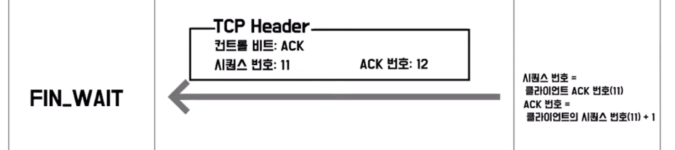
    * 서버에서 close 호출하고 플래그는 FIN 설정해 클라이언트에게 전달

    **응답**
    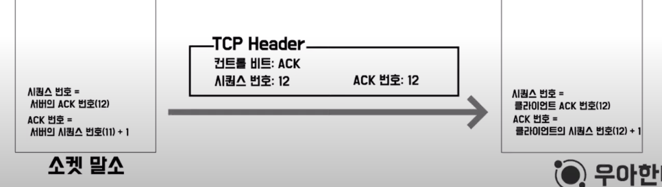
    * 클라이언트는 이를 잘 받았다는 의미로 플래그 ACK 설정해 서버에게 전달

    **소켓 말소**
    * 일정 시간 뒤에 클라이언트 소켓 말소되며 연결 종료됨
 
    **클라이언트 소켓이 바로 말소되지 않고 일정 시간 뒤에 말소되는 이유는?**
    * 서버가 ACK 패킷을 받지 못한 경우 재요청을 할 수 있기 때문임


## UDP

### 정의

### UDP 헤더

### UCP 데이터 전송


---
1. PORT란? 주요 PORT?
2. TCP와 UDP란? 공통점과 차이점
3. 3-way handshake
4. 4-way handshake
5. NAT
6. PORT