## Transport 계층
### 정의
Transmission Control Protocol (사용자 전송 제어 프로토콜)

    **End Point 간 `신뢰성` 있는 데이터 `전송`을 담당하는 계층**

    ```
    * 신뢰성 : 데이터를 순차적, 안정적인 전달
    * 전송 : 포트 번호에 해당하는 프로세스에 데이터 전달

    port 번호 사용하여
    도착지 컴퓨터의 최종 도착지인 프로세스까지 
    데이터가 도착하게 하는 모듈
    ```

### 회선 교환 방식 vs 패킷 교환 방식

## TCP

### 정의

### 특징

1. 신뢰성 있음(Reliable): 패킷 손실, 중복, 순서 바뀜이 없음을 보장한다.
2. 연결지향적(Connection-oriented): 통신이 시작되기 전 송수신측 간 논리적 연결이 설정됨.
3. 양방향성(Full-Duplex): 항상 양방향 통신이 가능함. 클라이언트 → 서버 서버 → 클라이언트
단대단(1:1) 전송 방식: 멀티 캐스트(1:多)가 불가능함.
4. 세그먼트화 처리: 바이트를 모아 세그먼트화 하고, 헤더를 붙여 순서를 제어한다.
5. 흐름 제어: 순서 번호, 승인 번호, 윈도우 크기 를 통해 흐름을 제어한다.
6. 혼잡 제어: 수신 윈도우 및 혼잡 윈도우 변수 값을 통해 네트워크가 혼잡하다고 판단되면 송신률을 감속함.

### 세그먼트

1. 역할
4계층 프로토콜의 데이터 단위

2. 헤더 구성

    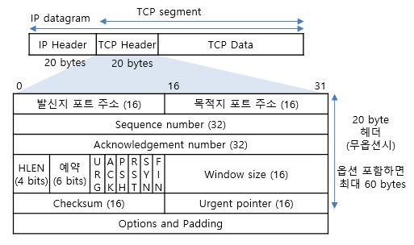


3. 플래그
* SYN : 
* ACK :
* FIN :

4. 시퀀스 번호
* 순서 구분을 위한 바이트 단위 번호


5. ACK 번호
* 수신을 기대하는 바이트 번호

### 동작 과정

1. **소켓 생성**

* 브라우저에서 도메인과 사용할 타입(TCP)를 설정해 소켓 호출함
* 프로토콜 스택이 이를 받아서 소켓 작성해 브라우저에게 디스크립터 반환함


2. **3-way handshake** - connection 연결
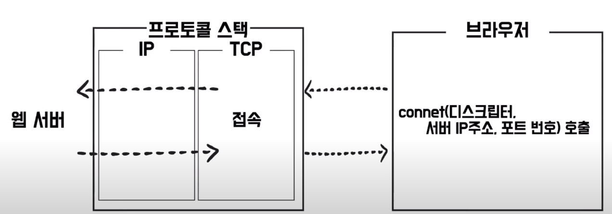
* 브라우저에서 반환받은 디스크립터, 서버 IP 주소, 포트 번호와 함께 요청
* 프로토콜 스택이 이 요청을 받아서 웹서버로 요청 전달함

    **전체 요약**
    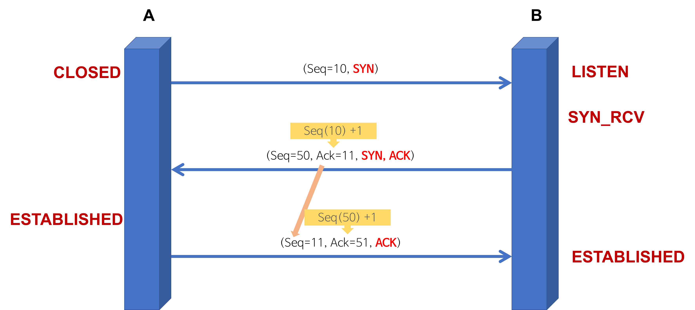

    **연결 요청**
    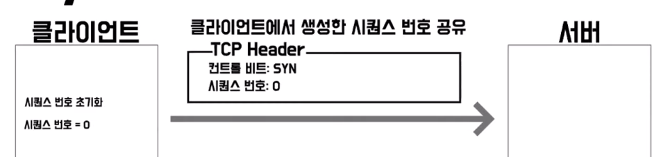

    **응답 + 연결 요청**
    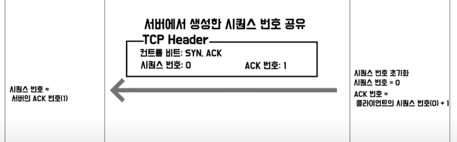

    **응답**
    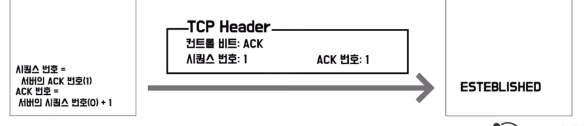

3. **데이터 송신과 수신**


    **데이터 송신**
    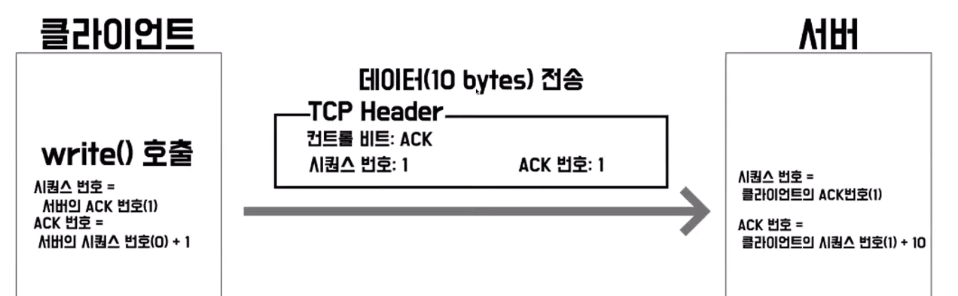
    * 클라이언트에서 write 호출
    * 브라우저에서 받은 HTTP request 메세지를 받아 패킷으로 만들어 서버에 전달

    **데이터 수신**
    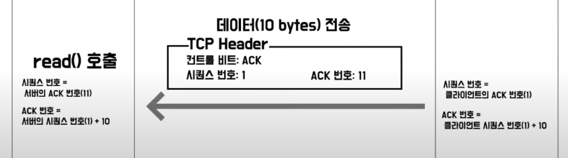
    * 클라이언트에 대한 응답을 위해 데이터를 만들고 패킷으로 클라이너트에게 전달
    * 클라이언트는 read 호출하여 데이터 읽음

    **중간에 패킷이 소실된 경우**
    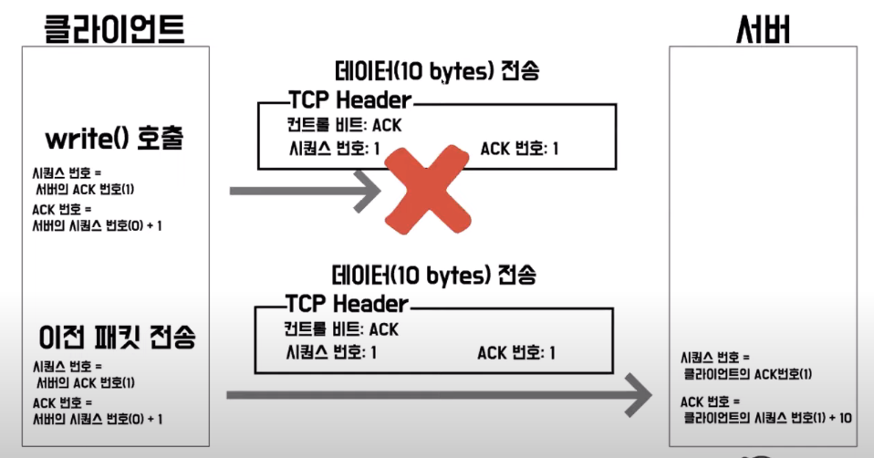
    * 클라이언트는 서버로부터 일정 시간 동안 응답이 오지 않으면 이전 패킷을 다시 재전송해 요청함
    * 재요청에 대해 또 응답이 오지 않으면, 클라이언트는 데이터 송신 작업 강제 종료하고 어플리케이션 오류 반환함

4. **4-way handshake** - connection close

    **전체 요약**
    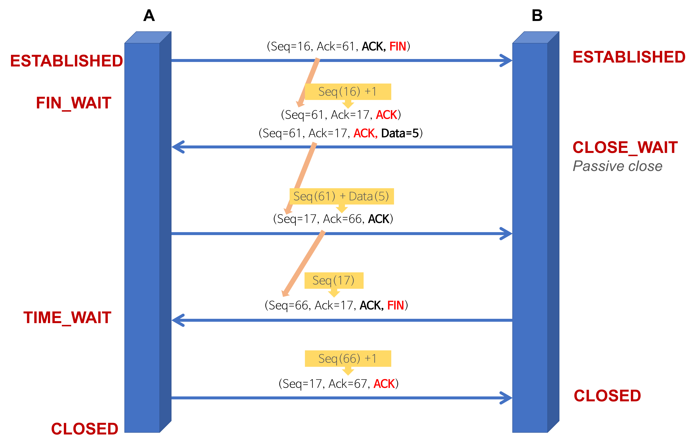

    **연결 종료**
    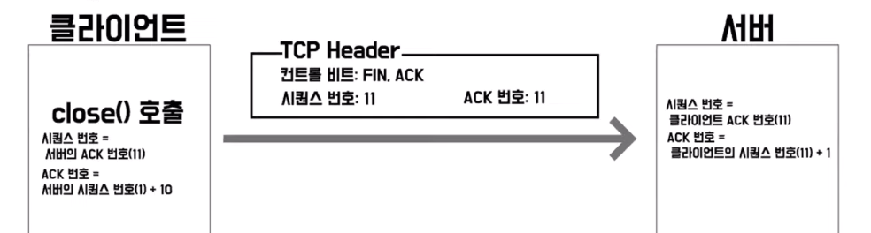
    * 클라이언트에서 연결 끊기를 위한 close 호출과 플래그 FIN 설정해 서버에게 전달

    **응답**
    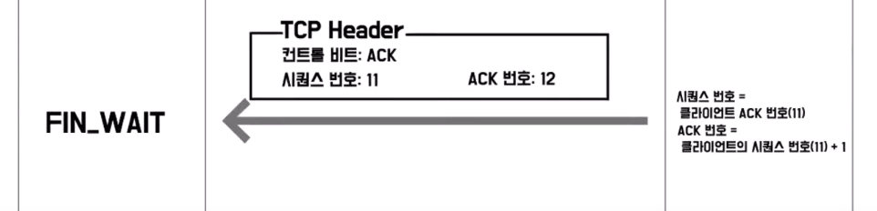
    * FIN에 대한 응답으로 플래그를 ACK로 설정해 응답
    * 클라이언트는 서버로 보냈던 FIN에 대한 응답 기다리는 상태

    **연결 종료**
    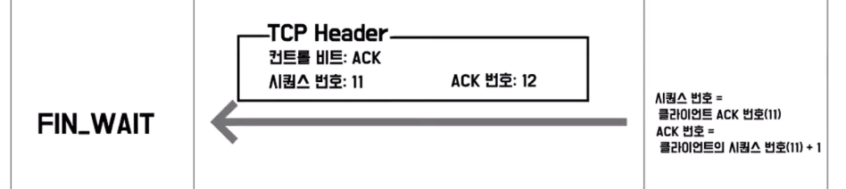
    * 서버에서 close 호출하고 플래그는 FIN 설정해 클라이언트에게 전달

    **응답**
    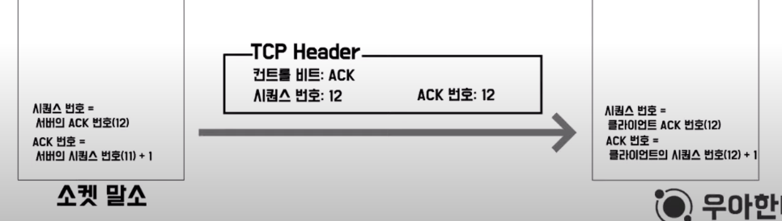
    * 클라이언트는 이를 잘 받았다는 의미로 플래그 ACK 설정해 서버에게 전달

    **소켓 말소**
    * 일정 시간 뒤에 클라이언트 소켓 말소되며 연결 종료됨
 
    **클라이언트 소켓이 바로 말소되지 않고 일정 시간 뒤에 말소되는 이유는?**
    * 서버가 ACK 패킷을 받지 못한 경우 재요청을 할 수 있기 때문임


## UDP

### 정의
User Datagram Protocol (사용자 데이터그램 프로토콜)

### 특징 
1. 비연결성 : handshake 없음
2. 신뢰성 없음: 흐름제어, 순서제어, 확인 응답 없음
3. 순서화되지 않음: 순서번호 필드가 존재하지 않음
4. 실시간 응용 및 멀티캐스트 가능
5. 단순한 헤더: 고정 8 바이트

### UDP 헤더
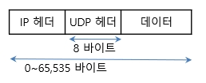
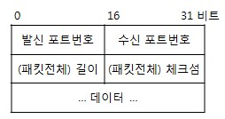
* 8 바이트 고정된 길이의 해더


### UCP 데이터 전송


1. **소켓 생성**
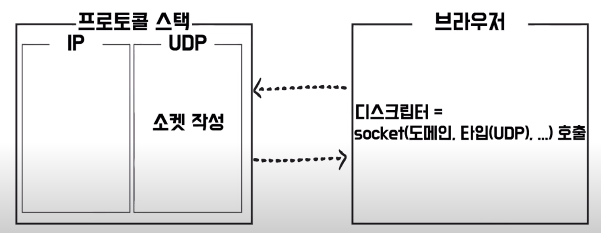
* 브라우저에서 도메인과 사용할 타입(UDP)를 설정해 소켓 호출함
* 프로토콜 스택이 이를 받아서 소켓 작성해 브라우저에게 디스크립터 반환함

2. **요청 및 데이터 송수신**
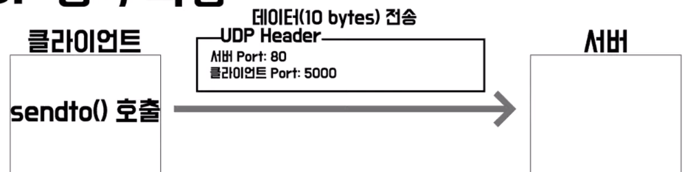
* 클라이언트가 sendto 호출하고, 브라우저로부터 받은 Http request 메세지를 받아 패킷으로 만들어 서버에 전송함

3. **응답 및 데이터 송수신**
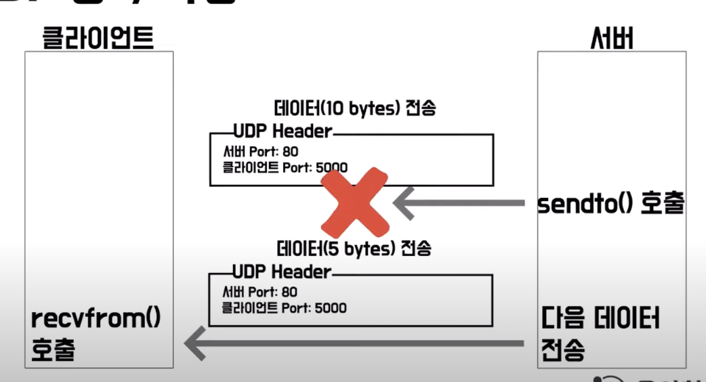
* 서버에서 응답을 위해 sendto 호출
* 패킷 소실되더라도 다음 데이터 바로 전송함 
* 클라이언트는 데이터 손실 여부와 무관하게 recvfrom 호출해 데이터 수신함

---
1. PORT란? 주요 PORT?
2. TCP와 UDP란? 공통점과 차이점
3. 3-way handshake
4. 4-way handshake
5. NAT
6. PORT

---
1. 3 way handshake


2. 데이터 교환 과정


3. 4 way handshake 


4. TCP vs UDP 

## 참고
https://wormwlrm.github.io/2021/09/23/Overview-of-TCP-and-UDP.html

https://www.youtube.com/watch?v=ad4AO1shXsY